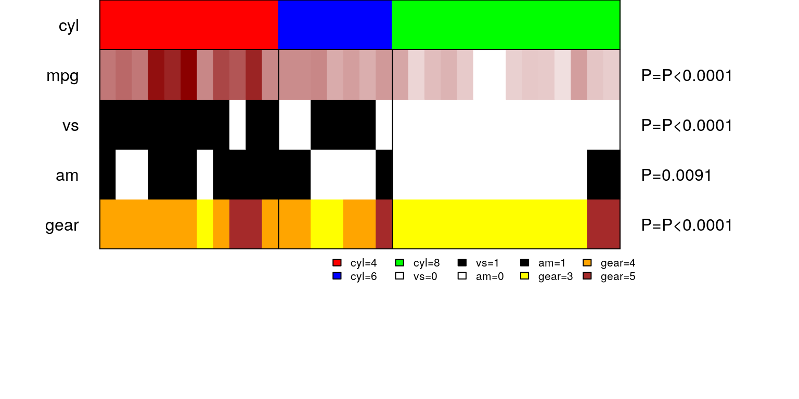

Understanding panelmap
================

<!-- generated by README.Rmd -->

## Installation

``` r
library(devtools)
install_github("arorarshi/panelmap")
```

## Requirements

*panelmap* requires the following packages - `coin, plyr and circlize`

## Introduction

*panelmap* creates panels for summarizing binary data, categorical data
(more than 2 categories) and continuous data for known groups. Groups
can arise from classification algorithms such as kmeans, or other class
labels as provided by the user. *panelmap* is a visual aid to understand
associations and trends in data instead from tedious tables and trying
to infer multiple plots.

Each row of *panelmap* is called a *panelet* (singular). Many panelets
assemble together to make a *panelmap* . We first begin by making a
panelet for the solution. See [panelet\_group](#panelet_group). Rest of
the variables are plotted according to the nature of the data - discrete
(binary/categorical) - See [panelet\_category](#panelet_category) , or
continuous - See [panelet\_continuous](#panelet_continuous) . The
function, [makepanel](#makepanel) , is a wrapper function of the above
mentioned functions.

We will use `mtcars` data set to illustrate the usage of panelmap.

See below an example of `panelmap`.

## Example - panelmap

We will illustrate *panlemap* by sorting mtcars data according to
variable `cyl` and plotting `mpg, vs, am` and `gear` to understand the
relationship between them.

``` r

#sort everything by cyl
mtcars.sort = mtcars[order(mtcars$cyl),]
#otehr features to plot
mat = mtcars.sort[,c("mpg","vs","am","gear")]

#color assigned to each feature
mat.col=list(am=c("white","black"), vs=c("white","black"), gear=c("yellow","orange","brown"), mpg=c("white", "darkred"))

#type of each feature. type=1 for discrete and type=2 for continuous. 
mat.type= c(2,1,1,1)
tab=makepanel(soln=mtcars.sort$cyl, soln.name="cyl",soln.col=c("red","blue","green"), mat=mat, mat.col=mat.col, mat.type=mat.type, border=TRUE, legend=TRUE, get.pval=TRUE)
## Performing Kruskal-Wallis test
## Performing Fisher's Exact test
## Performing Fisher's Exact test
## Performing Fisher's Exact test
```



One can see, how all the variables align with vehicles with 4,6 and 8
cylinder engines, all at a single glance\!

`vs` - Binary variable signaling the engine cylinder configuration a
V-shape (vs=0) or Straight Line (vs=1). V

`am` - A binary variable signaling whether vehicle has automatic (am=0)
or manual (am=1) transmission configuration.

## Example - circomap

*circomap* is a visualizing tool to plot and analyze multiple panelmaps,
inspired by the circlize<sup>1</sup> package.

To illustrate the functionality of *circomap* we will draw the above
panelmap three times in a circular layout.

``` r
#dataset 1
dat1 = mtcars[order(mtcars$cyl),]
#dataset 2
dat2 = mtcars[order(mtcars$cyl),]
#dataset 3
dat3 = mtcars[order(mtcars$cyl),]

#put all the datasets in a list 
datasets<-list()
datasets[[1]]=dat1; datasets[[2]]=dat2; datasets[[3]]=dat3
names(datasets) = c("dat1", "dat2", "dat3")
#names of datasets will be used to labek the datasets

#group variable to plot same as panelet_group
gtoplot<-c("cyl")
gcol = c("red","blue","green")
gheight = 0.10 #track height of the group variable 

#features to plot - same as in panelmap example 
ftoplot<-c("mpg", "vs", "am", "gear")
ftype= c(2,1,1,1)
fcol=list(am=c("white","black"), vs=c("white","black"), gear=c("yellow","orange","brown"), mpg=c("white", "darkred"))

fheight<-list(); fheight[1:length(ftoplot)] = 0.08
#Voila!! 
circomap(datasets, gtoplot, gcol, gheight, ftoplot, ftype, fcol, fheight)
```


\#\#Functions and Usage

There are three core functions of `panelmap`.

### panelet\_group

Given a solution, make a group panelet. Let `cyl` variable with values
4,6 and 8 be our group variable from package `mtcars`. Let’s assign the
colors `red`, `blue` and `green` to its values as follows :-

``` r
#adjust margins and number of panelet values 
par(mfrow=c(3,1),mar=c(0,8,0,14))

#sort the entire data frame according to the group solution you are interested in 
mtcars.sort = mtcars[order(mtcars$cyl),]

#plot group
tt=panelet_group(soln=mtcars.sort$cyl, soln.col=c("red","blue","green"),soln.name="cyl",cex=1, border=FALSE, legend=FALSE)
```


`cex` controls the magnification of text labels on the left-hand side
and is passed as part of `(...)`. Other relevant parameters that can be
passed are `col` - to change color of text labels. `lty` and `lwd` to
change border line type and magnification, as in baseR. `border` and
`legend` take logical values and their default value is `FALSE`.

Once we have a group panelet, we can start plotting other variables of
interest.

### panelet\_category

This function plots discrete data type. Usage -
`function(pp,pp.col,soln, var.n="var.n"`

`NA.flag=FALSE, NA.col="grey", get.pval=FALSE, border=FALSE,
border.col="black", legend=FALSE)`

These are the default values to the function. There is an option to
assign a color for `NAs` in the data by using `NA.flag` and `NA.col`.
User can also control the color of border colors by `border.col`

``` r
#adjust margins and number of panelet values 
par(mfrow=c(6,1),mar=c(0,8,0,14))

#sort the entire data frame according to the group solution you are interested in 
mtcars.sort = mtcars[order(mtcars$cyl),]

#plot group
tt=panelet_group(soln=mtcars.sort$cyl, soln.col=c("red","blue","green"),soln.name="cyl",cex=1, border=FALSE, legend=FALSE)

#plot variable am
tt=panelet_category(pp=mtcars.sort$am, pp.col=c("white", "black"), soln=mtcars.sort$cyl, var.n="am", get.pval=TRUE)

#plot variable vs
tt=panelet_category(mtcars.sort$vs, c("white", "black"), mtcars.sort$cyl, "vs", get.pval=TRUE)

#let's assign NAs to am
am.na = mtcars.sort$am
am.na[c(1,10,20,30)] = NA
tt=panelet_category(pp=am.na, pp.col=c("white", "black"), soln=mtcars.sort$cyl, var.n="am.na", get.pval=TRUE, NA.flag=TRUE, NA.col="grey", col = "red")
```


See how there are grey bars in panelet row **am.na** corresponding to NA
at values 1,10,20 and 30.

`panelet_category` also returns the summary of the variable with respect
to the group variable along with an association test.

### panelet\_continuous

This function provides a gradient of the values present in the
continuous variable. Note that this function plots a gradient and
assigns colors relative to the range and magnitude of values in the
variable. If the values are a mix of negative and positive values the
gradient might look biased and lack in contrast. We will try to address
this in a future functionality.

``` r
#adjust margins and number of panelet values 
par(mfrow=c(6,1),mar=c(0,8,0,14))

#sort the entire data frame according to the group solution you are interested in 
mtcars.sort = mtcars[order(mtcars$cyl),]

#plot group
tt=panelet_group(soln=mtcars.sort$cyl, soln.col=c("red","blue","green"),soln.name="cyl",cex=1, border=TRUE, legend=FALSE)

#plot variable mpg
tt =panelet_continuous(mtcars.sort$mpg, pp.col=c("white","darkred"), soln=mtcars.sort$cyl,var.n="mpg",NA.flag=FALSE, get.pval=TRUE, border=TRUE)
## Performing Kruskal-Wallis test
```


### makepanel

`makepanel` is a wrapper function that outputs a legend, an association
table and the panelmap, all with one command. You need to provide the
meta information of your data set like, colors, data type, labels color
etc. See [Example -
panelmap](#example---panelmap)

``` r
kable(tab, caption="Association table corresponding to panelmap")
```

|      | 4               | 6                 | 8                 | RowTotal   | pval      |
| ---- | :-------------- | :---------------- | :---------------- | :--------- | :-------- |
| mpg  | 26\[21.4-33.9\] | 19.7\[17.8-21.4\] | 15.2\[10.4-19.2\] |            | P\<0.0001 |
| NA   | 0               | 0                 | 0                 |            |           |
| vs   |                 |                   |                   |            | P\<0.0001 |
| 0    | 1(9%)           | 3(43%)            | 14(100%)          | 18(56.25%) |           |
| 1    | 10(91%)         | 4(57%)            | 0(0%)             | 14(43.75%) |           |
| am   |                 |                   |                   |            | 0.0091    |
| 0    | 3(27%)          | 4(57%)            | 12(86%)           | 19(59.38%) |           |
| 1    | 8(73%)          | 3(43%)            | 2(14%)            | 13(40.62%) |           |
| gear |                 |                   |                   |            | P\<0.0001 |
| 3    | 1(9%)           | 2(29%)            | 12(86%)           | 15(46.88%) |           |
| 4    | 8(73%)          | 4(57%)            | 0(0%)             | 12(37.5%)  |           |
| 5    | 2(18%)          | 1(14%)            | 2(14%)            | 5(15.62%)  |           |

Association table corresponding to panelmap

### circomap

to do

\#\#Reference 1. Gu, Z. circlize implements and enhances circular
visualization in R. Bioinformatics 2014.
