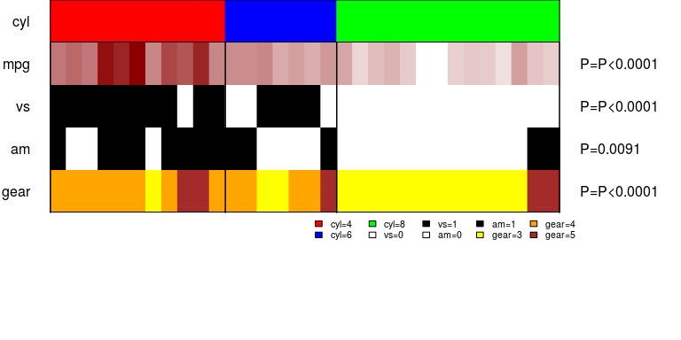
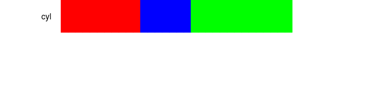
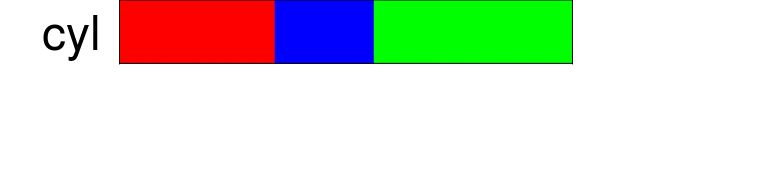
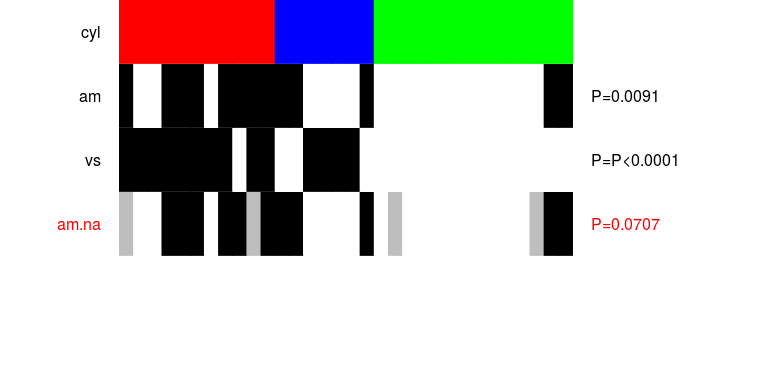
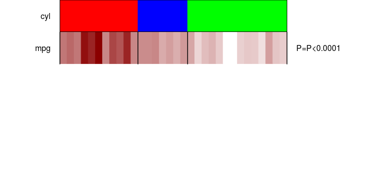

Understanding panelmap
================

Introduction
------------

*panelmap* creates panels for summarizing binary data, categorical data (more than 2 categories) and continuous data for known groups. Groups can arise from classification algorithms such as kmeans, or other class labels as provided by the user. *panelmap* is a visual aid to understand associations and trends in data instead from tedious tables and trying to infer multiple plots.

Each row of *panelmap* is called a *panelet* (singular). Many panelets aassemble together to make a *panelmap* . We first begin by making a panelet for the solution. See [panelet.group](#panelet.group). Rest of the variables are plotted according to the nature of the data - discrete (binary/categorical) - See [panelet.category](#panelet.category) , or continuous - See [panelet.continuous](#panelet.continuous) . The function, [make.panel](#make.panel) , is a wrapper function of the above mentioned functions.

We will use `mtcars` data set to illustrate the usage of panlemap.

See below an example of `panelmap`.

``` r
mtcars.sort = mtcars[order(mtcars$cyl),]
mat = mtcars.sort[,c("mpg","vs","am","gear")]
mat.col=list(am=c("white","black"), vs=c("white","black"), gear=c("yellow","orange","brown"), mpg=c("white", "darkred"))

mat.type= c(2,1,1,1)
tt=make.panel(soln=mtcars.sort$cyl, soln.name="cyl",soln.col=c("red","blue","green"), mat=mat, mat.col=mat.col, mat.type=mat.type, border=TRUE, legend=TRUE)
```

    ## Performing Kruskal-Wallis test

    ## Performing Fisher's Exact test
    ## Performing Fisher's Exact test
    ## Performing Fisher's Exact test



One can see, how all the variables align with vehicles with 4,6 and 8 cylinder engines, all at a single glance!

`vs` - Binary variable signaling the engine cylinder configuration a V-shape (vs=0) or Straight Line (vs=1). V

`am` - A binary variable signaling whether vehicle has automatic (am=0) or manual (am=1) transmission configuration.

Functions and Usage
-------------------

There are three core functions of `panelmap`.

### panelet.group

Given a solution, make a group panelet. Let `cyl` variable with values 4,6 and 8 be our group variable from package `mtcars`. Let's assign the colors `red`, `blue` and `green` to its values as follows :-

``` r
#adjust margins and number of panelet values 
par(mfrow=c(3,1),mar=c(0,8,0,14))

#sort the entire data frame according to the group solution you are interested in 
mtcars.sort = mtcars[order(mtcars$cyl),]

#plot group
tt=panelet.group(soln=mtcars.sort$cyl, soln.col=c("red","blue","green"),soln.name="cyl",cex=1, border=FALSE, legend=FALSE)
```



`cex` controls the magnification of text labels on the left-hand side. `border` and `legend` take logical values and their default value is `FALSE`.

``` r
#adjust margins and number of panelet values 
par(mfrow=c(3,1),mar=c(0,8,0,14))

tt=panelet.group(soln=mtcars.sort$cyl, soln.col=c("red","blue","green"),soln.name="cyl",cex=3, border=TRUE)
```



Once we have a group panelet, we can start plotting other variables of interest.

### panelet.category

This function plots dicrete data type. Usage - `function(pp,pp.col,soln, var.n="var.n",labels.col="black",`

`NA.flag=FALSE, NA.col="grey", get.pval=FALSE, border=FALSE, cex=1, border.col="black", legend=FALSE)`

These are the default values to the function. There is an option to assign a color for `NAs` in the data by using `NA.flag` and `NA.col`. User can also control the color of border colors by `border.col`

``` r
#adjust margins and number of panelet values 
par(mfrow=c(6,1),mar=c(0,8,0,14))

#sort the entire data frame according to the group solution you are interested in 
mtcars.sort = mtcars[order(mtcars$cyl),]

#plot group
tt=panelet.group(soln=mtcars.sort$cyl, soln.col=c("red","blue","green"),soln.name="cyl",cex=1, border=FALSE, legend=FALSE)

#plot variable am
tt=panelet.category(pp=mtcars.sort$am, pp.col=c("white", "black"), soln=mtcars.sort$cyl, var.n="am", get.pval=TRUE)

#plot variable vs
tt=panelet.category(mtcars.sort$vs, c("white", "black"), mtcars.sort$cyl, "vs", get.pval=TRUE)

#let's assign NAs to am
am.na = mtcars.sort$am
am.na[c(1,10,20,30)] = NA
tt=panelet.category(pp=am.na, pp.col=c("white", "black"), soln=mtcars.sort$cyl, var.n="am.na", get.pval=TRUE, NA.flag=TRUE, NA.col="grey", labels.col = "red")
```



See how there are grey bars in panelet row **am.na** corresponding to NA at values 1,10,20 and 30.

`panelet.category` also returns the summary of the variable with respect to the group variable along with an association test.

``` r
kable(tt$tab)
```

|       | 4(n=11;34.38%) | 6(n=7;21.88%) | 8(n=14;43.75%) | RowTotal   | pval   |
|-------|:---------------|:--------------|:---------------|:-----------|:-------|
| am.na |                |               |                |            | 0.0707 |
| 0     | 3(27%)         | 4(57%)        | 10(71%)        | 17(53.12%) |        |
| 1     | 6(55%)         | 3(43%)        | 2(14%)         | 11(34.38%) |        |
| NA    | 2(18%)         | 0(0%)         | 2(14%)         | 4(12.5%)   |        |

### panelet.continuous

This function provides a gradient of the values present in the continuous variable. Note that this function plots a gradient and assigns colors relative to the range and magnitude of values in the variable. If the values are a mix of negative and positive values the gradient might look biased and lack in contrast. We will try to address this in a future functionality.

``` r
#adjust margins and number of panelet values 
par(mfrow=c(6,1),mar=c(0,8,0,14))

#sort the entire data frame according to the group solution you are interested in 
mtcars.sort = mtcars[order(mtcars$cyl),]

#plot group
tt=panelet.group(soln=mtcars.sort$cyl, soln.col=c("red","blue","green"),soln.name="cyl",cex=1, border=TRUE, legend=FALSE)

#plot variable mpg
tt =panelet.continuous(mtcars.sort$mpg, pp.col=c("white","darkred"), soln=mtcars.sort$cyl,var.n="mpg", labels.col="black",NA.flag=FALSE, get.pval=TRUE, border=TRUE)
```

    ## Performing Kruskal-Wallis test



### make.panel

`make.panel` is a wrapper function that outputs a legend, an association table and the panelmap, all with one command. You need to provide the meta information of your data set like, colors, data type, labels color etc.

``` r
mat = mtcars.sort[,c("mpg","disp","hp","drat","wt","qsec","vs","am","gear")]

#colors to be used for each panelet
mat.col=list(am=c("white","black"), vs=c("white","black"), gear=c("yellow","orange","brown"), mpg=c("white", "darkred"), disp=c("white", "darkblue"), hp=c("white","black"), drat=c("white","darkred"), wt=c("white","darkblue"), qsec=c("white","black"))

#where 1= discrete, panelet.category and 2=continuous, panelet.continuous 
mat.type= c(2,2,2,2,2,2,1,1,1)

tt=make.panel(soln=mtcars.sort$cyl, soln.name="cyl",soln.col=c("red","blue","green"), mat=mat, mat.col=mat.col, mat.type=mat.type, border=TRUE, legend=TRUE)
```

    ## Performing Kruskal-Wallis test
    ## Performing Kruskal-Wallis test
    ## Performing Kruskal-Wallis test
    ## Performing Kruskal-Wallis test
    ## Performing Kruskal-Wallis test
    ## Performing Kruskal-Wallis test

    ## Performing Fisher's Exact test
    ## Performing Fisher's Exact test
    ## Performing Fisher's Exact test


Note that, we code discrete data type as 1 and that prompts `make.panel` to use `panelet.category` and 2 as continuous in which case `panelet.continuous` will be performed. There is an option to return a summary table with `cyl` group to other features. The association test runs non-parametric tests for 2 or more than 2 groups accordingly.

``` r
kable(tt, caption="Association table corresponding to panelmap")
```

|      | 4                 | 6                  | 8                  | RowTotal   | pval        |
|------|:------------------|:-------------------|:-------------------|:-----------|:------------|
| mpg  | 26\[21.4-33.9\]   | 19.7\[17.8-21.4\]  | 15.2\[10.4-19.2\]  |            | P&lt;0.0001 |
| NA   | 0                 | 0                  | 0                  |            |             |
| disp | 108\[71.1-146.7\] | 167.6\[145-258\]   | 350.5\[275.8-472\] |            | P&lt;0.0001 |
| NA   | 0                 | 0                  | 0                  |            |             |
| hp   | 91\[52-113\]      | 110\[105-175\]     | 192.5\[150-335\]   |            | P&lt;0.0001 |
| NA   | 0                 | 0                  | 0                  |            |             |
| drat | 4.08\[3.69-4.93\] | 3.9\[2.76-3.92\]   | 3.12\[2.76-4.22\]  |            | 0.001       |
| NA   | 0                 | 0                  | 0                  |            |             |
| wt   | 2.2\[1.51-3.19\]  | 3.21\[2.62-3.46\]  | 3.75\[3.17-5.42\]  |            | P&lt;0.0001 |
| NA   | 0                 | 0                  | 0                  |            |             |
| qsec | 18.9\[16.7-22.9\] | 18.3\[15.5-20.22\] | 17.18\[14.5-18\]   |            | 0.006       |
| NA   | 0                 | 0                  | 0                  |            |             |
| vs   |                   |                    |                    |            | P&lt;0.0001 |
| 0    | 1(9%)             | 3(43%)             | 14(100%)           | 18(56.25%) |             |
| 1    | 10(91%)           | 4(57%)             | 0(0%)              | 14(43.75%) |             |
| am   |                   |                    |                    |            | 0.0091      |
| 0    | 3(27%)            | 4(57%)             | 12(86%)            | 19(59.38%) |             |
| 1    | 8(73%)            | 3(43%)             | 2(14%)             | 13(40.62%) |             |
| gear |                   |                    |                    |            | P&lt;0.0001 |
| 3    | 1(9%)             | 2(29%)             | 12(86%)            | 15(46.88%) |             |
| 4    | 8(73%)            | 4(57%)             | 0(0%)              | 12(37.5%)  |             |
| 5    | 2(18%)            | 1(14%)             | 2(14%)             | 5(15.62%)  |             |
